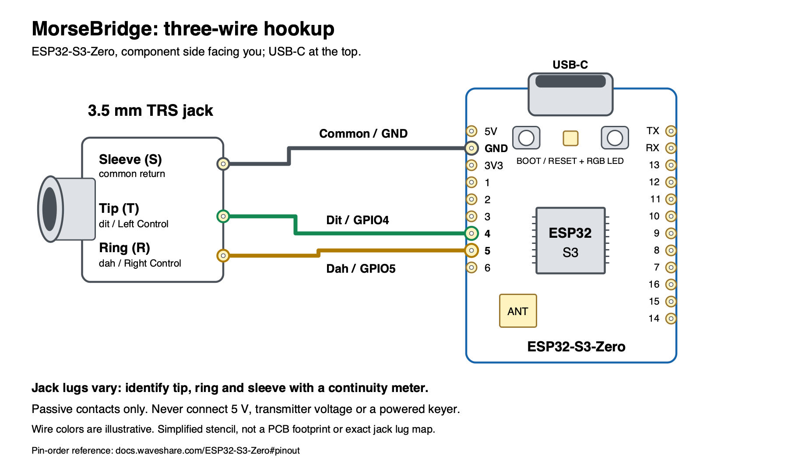

# MorseBridge

**Use your Morse paddle with your favorite CW app, over USB or Bluetooth.**
MorseBridge is a small adapter built around the **Waveshare ESP32-S3-Zero**.
It turns paddle presses into keyboard input; the app handles Morse timing and
sidetone. No display, menus or standalone computer are needed when using a phone.

  
  

## How it connects

**USB-C is at the top; the board's component side faces you.** Jack terminals
are symbolic: identify the actual tip, ring and sleeve lugs with a continuity meter.

**USB takes priority when a host configures it.** With a charger or power bank,
use Bluetooth instead. Only one connection sends paddle input at a time.

## Get started

You need an **ESP32-S3-Zero (4 MB flash / 2 MB PSRAM)**, a passive iambic
paddle, a 3.5 mm TRS jack and a USB-C data cable.

1. **Wire the jack:** tip to **GPIO4** (dit), ring to **GPIO5** (dah), sleeve to
   **GND**. Verify the jack's lug mapping before soldering.
2. **Download the [latest firmware release](https://github.com/dcasati/morsebridge/releases/latest)**
   and follow the [flashing instructions](docs/flashing.md). No compiling required.
3. **Connect:** use a USB-C data cable to your phone/computer, or power from a
   charger/power bank and pair with **MorseBridge** over Bluetooth.
4. **Configure the app:** enable keyboard/paddle input, set **dit = Left Control**
   and **dah = Right Control**, then open its sending screen.
5. **Release both paddles to arm**, then start sending. Repeat after changing
   connections. [Morse-it setup details](docs/guide.md#iphone-and-morse-it).

**Passive contacts only:** never connect transmitter/keying voltage, 5 V or a
powered keyer output to the GPIOs. Straight-key mode is not supported yet.

## Known-working apps

User-confirmed; individual USB/Bluetooth and device/browser combinations are
not yet documented.

- [Morse Code Complete: Learn CW](https://apps.apple.com/ca/app/morse-code-complete-learn-cw/id6759272226)
- [Morse-It](https://apps.apple.com/ca/app/morse-it/id284942940)
- [VBand](https://hamradio.solutions/vband/)

## Status light

| Color | Meaning |
| --- | --- |
| Cyan | USB ready |
| Green | Bluetooth ready |
| Blue | Waiting for a connection |
| Amber | Waiting for readiness, USB resume or paddle release |
| Red | Connection/report error; reset and check [diagnostics](docs/guide.md#diagnostics-and-behavior) |

A Mac/PC data connection selects USB even when you only open a serial monitor.
Use a charger or power bank when you want Bluetooth input on another device.

## Print a case

**45 x 24 x 16 mm enclosure**, with a snap-fit lid and release slots.

Download and print the linked base and lid as a matching pair. The prototype
was printed in **PLA+**; **PETG is also an option**. Check fit and clip strength
before installing the electronics.

[Base STL](enclosure/v6/morsebridge_base_45x24x16_v6.stl) |
[Lid STL](enclosure/v6/morsebridge_lid_45x24x16_v6.stl) |
[Printing and fit notes](enclosure/FIT-CHECK.txt)

## Guides

[Build, flash and BOOT recovery](docs/guide.md#build) |
[Troubleshooting](docs/guide.md#diagnostics-and-behavior) |
[BLE-only rollback](docs/guide.md#ble-only-rollback) |
[Editable wiring diagram](assets/morsebridge-board-wiring.excalidraw)

## License

[MIT](LICENSE). Adapted from [Morse Tutor](https://github.com/dcasati/morse-tutor),
retaining the original **Copyright (c) 2019 Bruce E. Hall** notice.
[Provenance details](docs/guide.md#provenance-and-license).
